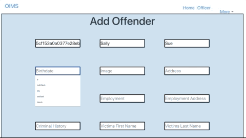
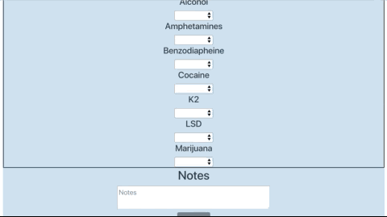
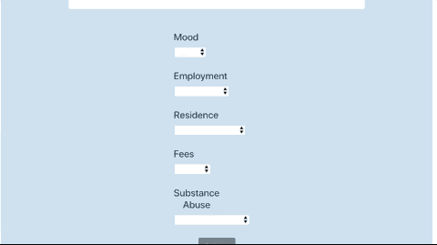
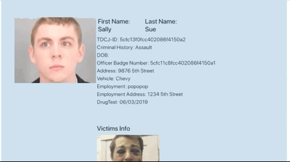

# OIMS-Offenders Information Mangement System

**Purpose** The purpose of the OIMS website is to provide parole/probation officers with a way to manage their offenders that
are released from prison.

**How to use:** When users land on our website they have the option to register or log in. The routes are protected until a user can log in. Once you log in you receive a json web token and you are directed to the parole officers page. As of right now the only access point that is built is the admin level. As a admin can add a parole officer to the database. Admin then goes to the offender page. Admin can add and view the offenders on this page. Admin can update, add drug test, show drug test, add contact, show contacts, and terminate the offender. Admin also has a feature of searching for a specifc offender in the search page. 

**Features:** React, Redux, ReactStrap, Node.JS, Express, MongoDB, Mongoose, CSS, json web tokens

**Videos:** Videos of the application

Video of login/registration and how the routes are proctected until you log in

 

Video of admin adding a new parole officer to the database

Video of admin adding a new offender to the database

 

Video of admin adding a new drug test to the database

 

Video of admin adding a new contact log to the database

Video of admin showing both the drug test list and contact list 

**Future Features:** An offender view so they would be allowed to see their next parole visit. See their stipulations such as when
they have to attend classes and how many time a week. Chat features that allows the offender and the parole officer to communicate. 
